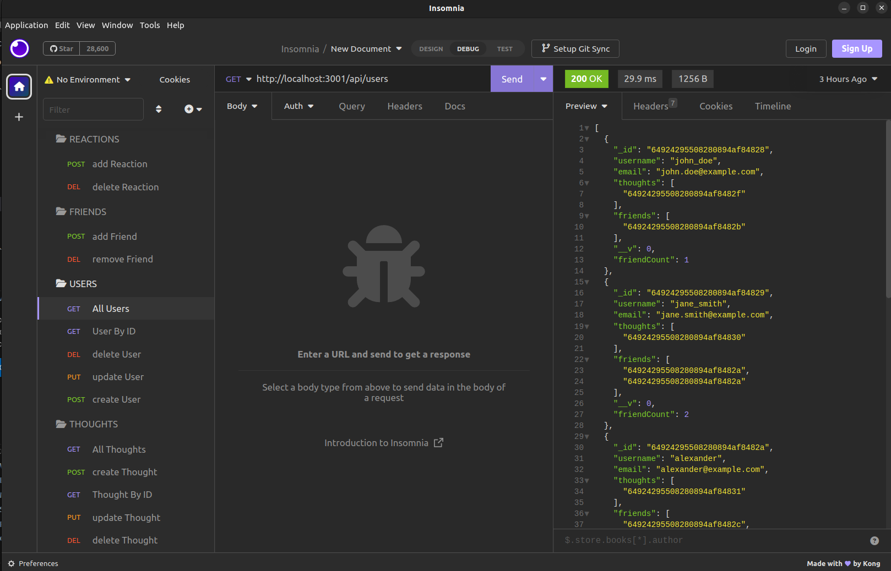
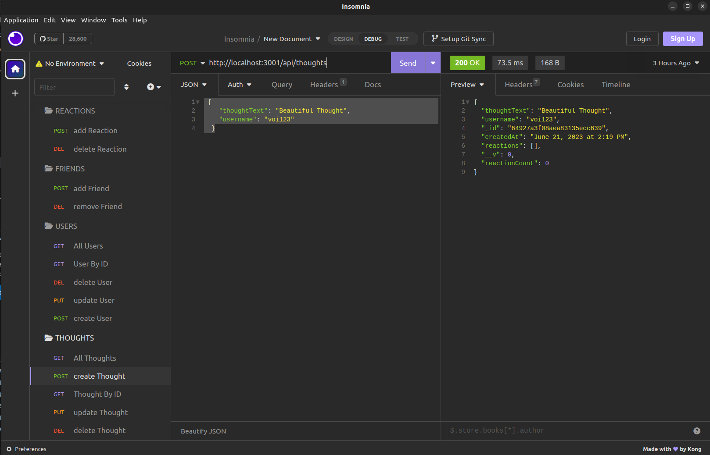
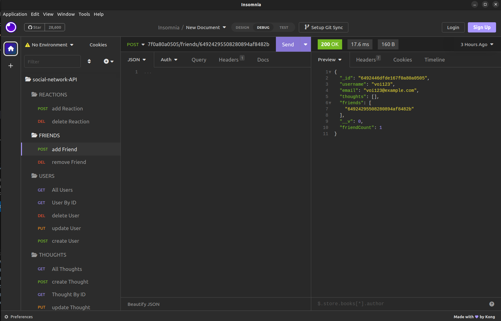

# Social Network Back End

[](https://opensource.org/licenses/MIT)

## Description

The Social Network API is a backend application that provides API routes for managing users, thoughts, reactions, and friends in a social network. It is built with Node.js, Express.js, and Mongoose, and uses MongoDB as the database.

## Table of Contents

- [Installation](#installation)
- [Usage](#usage)
- [License](#license)
- [Contributing](#contributing)
- [Questions](#questions)
- [Links](#links)

## Installation

1. Clone the repo

   ```sh
   git clone https://github.com/voi-jankowski/social-network-api.git
   ```

2. Install dependencies

   ```sh
   npm install
   ```

3. Initiate the server

   ```sh
   npm start
   ```

4. Use an API testing tool (e.g., Insomnia, Postman) to interact with the API endpoints.

<p align="right">(<a href="#readme-top">back to top</a>)</p>

## Usage

The server will be started and the Mongoose models will be synced to the MongoDB database. You can use the following API routes to manage users, thoughts, reactions, and friends:

- GET /api/users: Get all users.

  

- GET /api/users/:userId: Get a single user by ID.

- POST /api/users: Create a new user.

- PUT /api/users/:userId: Update a user by ID.

- DELETE /api/users/:userId: Delete a user by ID.

- GET /api/thoughts: Get all thoughts.

- GET /api/thoughts/:thoughtId: Get a single thought by ID.

- POST /api/thoughts: Create a new thought.

  

- PUT /api/thoughts/:thoughtId: Update a thought by ID.

- DELETE /api/thoughts/:thoughtId: Delete a thought by ID.

- POST /api/thoughts/:thoughtId/reactions: Create a new reaction for a thought.

- DELETE /api/thoughts/:thoughtId/reactions/:reactionId: Delete a reaction from a thought.

- POST /api/users/:userId/friends/:friendId: Add a friend to a user's friend list.

  

- DELETE /api/users/:userId/friends/:friendId: Remove a friend from a user's friend list.

Please refer to the API documentation or use an API testing tool to make requests to these routes and manage the social network.

<p align="right">(<a href="#readme-top">back to top</a>)</p>

## License

Distributed under the [MIT License](https://opensource.org/licenses/MIT). See LICENSE.txt for more information.

<p align="right">(<a href="#readme-top">back to top</a>)</p>

## Contributing

Contributions are welcome!
If you have a suggestion that would make this better, please fork the repo and create a pull request. You can also simply open an issue with the tag "enhancement".
Don't forget to give the project a star!

1. Fork the Project
2. Create your Feature Branch (`git checkout -b feature/YourFeature`)
3. Commit your Changes (`git commit -m 'Add Your Feature'`)
4. Push to the Branch (`git push origin feature/YourFeature`)
5. Open a Pull Request

<p align="right">(<a href="#readme-top">back to top</a>)</p>

## Questions

If you have any questions about the project please contact me through [my Github](https://github.com/voi-jankowski) or email me at [voi.jankowski@gmail.com](mailto:voi.jankowski@gmail.com).

<p align="right">(<a href="#readme-top">back to top</a>)</p>

## Links

The location of the project [on GitHub](https://github.com/voi-jankowski/social-network-api).

The walkthrough video can be accessed on [here](https://drive.google.com/file/d/1RXcv0co4oSyFuWFxGCh35C7-WFQp_DWd/view).

<p align="right">(<a href="#readme-top">back to top</a>)</p>
